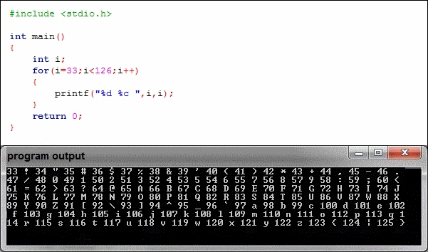

# أهلاً وسهلاً! 👋

أنا مطوّر شغوف أؤمن بأن البرمجة ليست مجرد كتابة شيفرات، بل وسيلة للتعلّم، الإبداع، والمساهمة في تطوير المجتمعات. أرى في التقنية أداة تمكّننا من مشاركة الأفكار والمعرفة، وبناء منصات تلهم الآخرين للابتكار والتقدّم.

---

### ✨ **نبذة عني**

لست هنا للحديث عن الإنجازات بقدر ما أريد التركيز على ما يمكننا فعله معاً. أعتبر أن **تعليم الآخرين هو أعظم إنجاز** يمكن أن يحققه المبرمج، لذلك أخصص جزءاً كبيراً من وقتي لمشاركة ما أتعلمه، سواء من خلال مشاريع مفتوحة المصدر، أو محتوى تعليمي، أو إنشاء منصات تعزز التعلّم الجماعي.

رحلتي في البرمجة بدأت بحب بسيط لاستكشاف كيفية عمل الأشياء، لكنها تحوّلت إلى رؤية أكبر: **نشر العلم، تمكين الآخرين، وبناء مجتمعات تكنولوجية مبدعة**.

---

### 🌟 **قيم أؤمن بها**
- **المعرفة قوة:** البرمجة ليست هدفاً، بل وسيلة لفهم العالم من حولنا وإيجاد حلول ذكية لمشاكله.
- **التعليم مفتاح المستقبل:** أطمح إلى تسخير التقنية لنشر العلم وتعزيز التعليم في كل المجالات.
- **الابتكار من أجل التغيير:** أبحث دائماً عن طرق جديدة لتحويل الأفكار إلى تطبيقات تخدم الإنسان وتطوّره.

---

### 💡 **ما الذي أفعله؟**
#### **🧠 أتعلم باستمرار**
التعلّم هو المحرك الأساسي لي؛ أبحث دائماً عن تقنيات جديدة وأستمتع بفهم كيفية تحسين حياتنا باستخدام البرمجة.

#### **📚 أنشر المعرفة**
أشارك كل ما أتعلمه مع الآخرين، سواء من خلال دورات تعليمية، أو شروحات عبر الإنترنت، أو مشاريع مفتوحة المصدر.

#### **🌍 أعمل على بناء مجتمعات افتراضية**
أحلم بإنشاء مساحة تجمع الناس من مختلف أنحاء العالم للتعلم والتعاون، ومشاركة الأفكار والتجارب بهدف تحقيق تغيير إيجابي في مجالات مثل التعليم والتكنولوجيا.

---

### 🌍 **مهاراتي وخبراتي**
- **الواجهة الأمامية:** HTML، CSS، JavaScript، Bootstrap  
- **الواجهة الخلفية:** PHP، Laravel  
- **قواعد البيانات:** MySQL، Firebase  
- **برمجة الألعاب وتطبيقات سطح المكتب:** لأن الإبداع لا حدود له.  
- **أدوات التطوير:** Git، Docker، Visual Studio Code  

---

### 📊 **إحصائيات GitHub الخاصة بي**

  

  

  

  

  

---

### 🤝 **تواصل معي**
أعتقد أن التغيير يبدأ بفكرة، والفكرة تنمو عندما يتم تبادلها. دعونا نتعاون، نبتكر، ونتعلم معاً.

> "تعلم شيئاً جديداً اليوم، وشاركه مع شخص غداً."
